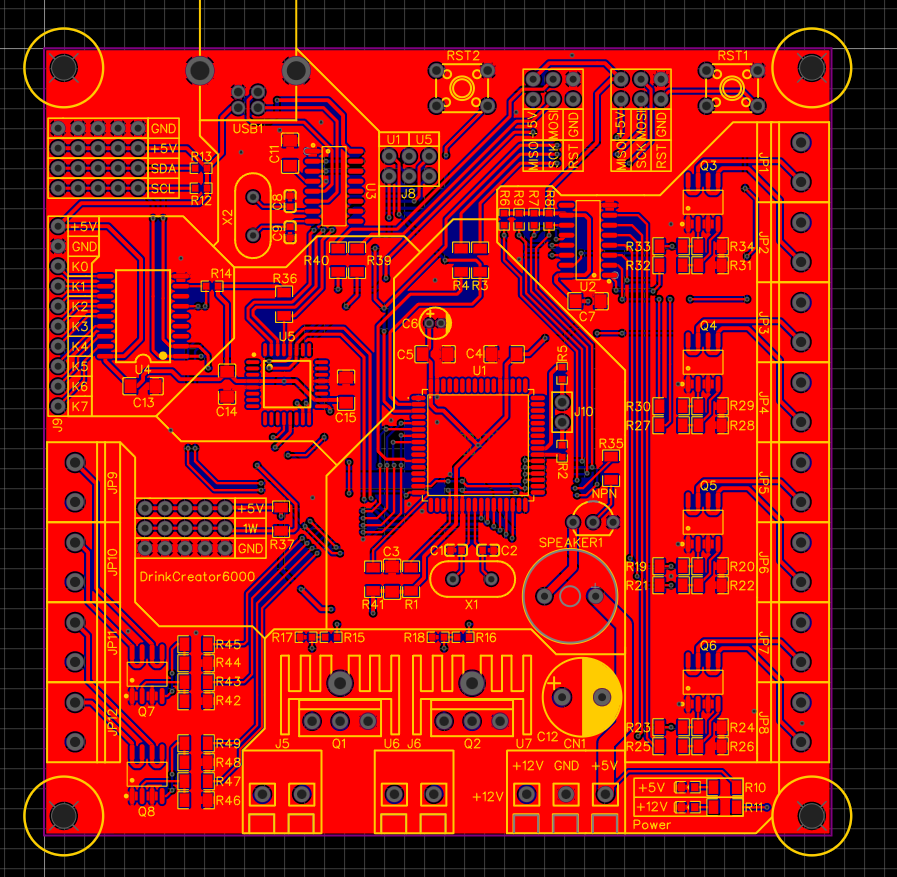
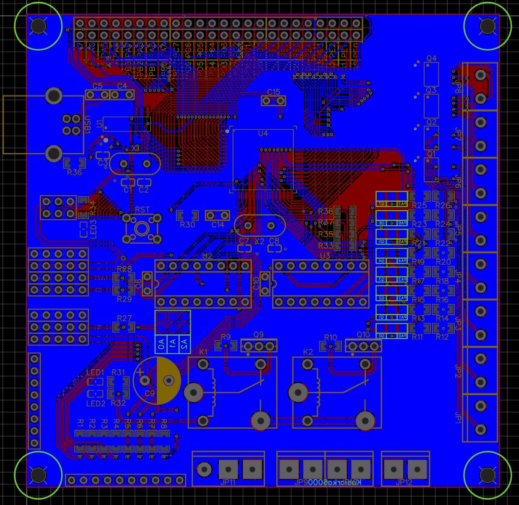

# DrinkCreator6000 – RTOS System on Custom AVR Board
DrinkCreator6000 is a real-time operating system (RTOS) project designed for a custom-built drink dispensing machine powered by an AVR microcontroller and FreeRTOS. The system is entirely based on static memory allocation for robustness and predictability, and integrates multiple hardware modules for a fully functional beverage control unit.

The machine is powered by a standard 400W ATX power supply, which provides stable 5V and 12V rails for the logic circuitry, Peltier cooling modules, and peristaltic pumps used for dispensing liquids. Pumps are controlled via a 74HC595 shift register, which expands digital output lines and drives MOSFET transistors to switch the high-current 12V loads safely and efficiently.

Temperature is regulated using Peltier elements coupled with an internal water cooling system, enclosed within the device chassis for thermal efficiency and thermal isolation.

User input is handled via an MCP23017 I²C I/O expander, which generates interrupts only when button states change and buffers the last known button state — minimizing CPU load and improving responsiveness. System status, temperature data, and diagnostics are displayed on a 2004 character LCD screen driven over the I²C bus, allowing real-time monitoring directly from the front panel.

> 🔧 Status: In development  
> 🧪 Goal: Create a fully functional, physical drink machine and explore structured multi-tasking using FreeRTOS AVR MCU.

---

## 🧠 Design Goals

- 🎯 Explore real-time scheduling and modular task separation
- 💾 Use 100% static memory allocation (no malloc, no heap)
- 🧰 Track system stability via runtime task/memory debug tools
- 🔁 Ensure recovery after failure using EEPROM fault logging
- 📟 Provide full system visibility through LCD diagnostics and monitoring
- 🧪 Serve as a practical testbed for FreeRTOS and embedded RTOS design
- 📚 Designed as an educational project to deepen understanding of multitasking, resource sharing, and fail-safe system design embedded systems
- 🧩 Implement low-level memory management techniques for optimized and reliable resource control

---

## 🧱 System Overview

The system is built around a custom-designed PCB featuring an ATmega2561 microcontroller. It uses FreeRTOS to run multiple independent tasks that manage the user interface, inputs, outputs, and internal logic.

Each screen or function (like selecting a drink or diagnostics) is handled by a dedicated software module. The interface guides the user through clear prompts, while internal tasks manage precise timing, input handling, and output control behind the scenes.

Key characteristics:
- Modular design for easy debugging and future expansion
- Fully statically allocated tasks for high reliability
- Built-in protection mechanisms against system faults
- Designed for responsiveness and predictable behavior

---

## 🖼️ Visual Overview

This section provides an overview of the DrinkCreator6000 machine itself — including its hardware design, PCB layout, electrical schematics, and LCD interface examples.

### 🎬 UI interface Demo

### 🎬 Project Demo

(Will be here soon)

---

## 🗺️ Roadmap

- ✅ Create custom PCB with AVR MCU and additional components
- ✅ Create functions for static allocation of Queues, Mutexes, and Semaphores
- ✅ Create function for displaying current RAM usage via serial monitor
- ✅ Create function for debugging the last unconfirmed error stored in EEPROM
- ✅ Create function for displaying the boot count from EEPROM via serial port
- ✅ Create stackOverflowHook for handling stack overflow errors
- ✅ Create task for handling critical system errors such as stack overflows and logging them to EEPROM
- ✅ Create task for debugging stack usage and runtime status of all tasks via serial monitor
- ✅ Create main task for coordinating other tasks
- ✅ Create task for handling regular LCD updates
- ✅ Create task for regulating temperature inside the freezer
- 🔄 Create task for handling keyboard input from MCP23017 with software debounce
- 🔄 Create task for selecting the drink to be ordered
- ✅ Create welcome screen task to display a greeting message with project name, version, and boot count on the LCD at system startup
- 🔄 Create task for processing the ordered drink (pump activation)
- ✅ Create task to display project information such as author, startup count, and current runtime
- 🔄 Create task to display and confirm the last saved error
- ✅ Implement software guard zones between task stacks for added protection and reliability
- 🔄 Review .map file and optimize memory by efficient variable placement using linker script (.ld file)
- 🔄 Create a custom memory segment named .task_data to store Task Control Blocks (TCBs), task stacks, and stack guard zones by modifying the linker script (.ld file)
- 🔄 Implement a guard zone watchdog inside taskErrorHandler to detect guard zone corruption, indicating potential stack overflows
- ✅ Separate code into multiple files for better readability

---

## 📟 UI Flow & Screens

| ID | Screen               | Description                                                                 |
|----|----------------------|-----------------------------------------------------------------------------|
| 0  | **Welcome Screen**    | Displays the project name, firmware version, and boot count.               |
| 1  | **Drink Select Screen** | Shows the current drink name, ingredients, and related info.              |
| 2  | **Drink Order Screen**  | Displays dispensing progress, drink name, and ETA.                        |
| 3  | **Show Info Screen** | Displays general system status including uptime, firmware version, boot count, author, freezer temperature, RAM usage, and task stack diagnostics. |
| 4  | **Show Task Stack Info Screen** | Displays detailed information about FreeRTOS task stacks, including task names, priorities, and high-water marks (minimum remaining stack). |
| 5  | **Show Last Error Screen**    | Displays last unconfirmed error stored in EEPROM  |

Screen transition diagram:
  
                            ╔════════════════════╗  
                            ║Drink Creator 6000  ║   
    0 Welcome Screen        ║Initializing...     ║ 
                            ║Please wait         ║                         
                            ║[#####-----]  50 %  ║   
                            ╚════════════════════╝ 
                                      ║
                                      ║
                                      ▼                         2 Drink Order Screen                    Submenu[1]
                            ╔════════════════════╗             ╔════════════════════╗             ╔════════════════════╗
                            ║[01]Test Drink      ║             ║[01]Test Drink      ║ Submenu[1]  ║[01]Test Drink      ║
    1 Drink Select Screen   ║Whiskey       50[ml]║  ═ ═ ═ ═ >  ║                    ║ --------->  ║                    ║
                            ║Rum          100[ml]║             ║Please wait...      ║             ║Done!               ║
                            ║Cola         250[ml]║             ║[########--]  82%   ║             ║[##########] 100%   ║                    
                            ╚════════════════════╝             ╚════════════════════╝             ╚════════════════════╝
                                      ║
                                      ║        +<----------------------------------------------------------------------------------------------------------------------------------------------------------------------------------<+
                                      ║        |                                                                                                                                                                                    |
                                      ▼        ▼                                                                                                                                                                                    |
                            ╔════════════════════╗             ╔════════════════════╗            ╔════════════════════╗            ╔════════════════════╗            ╔════════════════════╗            ╔════════════════════╗       |
                            ║Drink Creator 6000  ║  Submenu[1] ║Drink Creator 6000  ║ Submenu[2] ║Drink Creator 6000  ║ Submenu[3] ║RAM Info            ║ Submenu[4] ║RAM Info            ║ Submenu[5] ║RAM Info            ║       |
    3 Show System Info[0]   ║Software ver. 3.0   ║  ---------> ║Current run time    ║ ---------> ║T: 21.2°C  S:11.0°C ║ ---------> ║Usage: 6722 B/8192 B║ ---------> ║.data: 0x0200-0x1522║ ---------> ║HEAP:  0x1BF7-0x1BF7║ ----->+
                            ║Author: Alan Kudelko║             ║21 days  19 h       ║            ║Hyst: 4.0°C         ║            ║[########--]  82%   ║            ║.bss:  0x1522-0x1BF7║            ║STACK: 0x21B5-0x21FF║
                            ║Startup count: 1000 ║             ║39 min   22 s       ║            ║Status: Cooling     ║            ║                    ║            ║Size:  4898 B 1749 B║            ║Size:     0 B   74 B║
                            ╚════════════════════╝             ╚════════════════════╝            ╚════════════════════╝            ╚════════════════════╝            ╚════════════════════╝            ╚════════════════════╝
                                      ║
                                      ║
                                      ▼
                            ╔════════════════════╗             ╔════════════════════╗
                            ║[03]Task information║  Submenu[1] ║[03]Task information║
    4 Show Task Stack Info  ║UPDATE SCREEN       ║  ---------> ║####################║
                            ║Highwater mark:  100║             ║  MEMORY CORRUPTED  ║
                            ║PR:1 State:Suspended║             ║####################║
                            ╚════════════════════╝             ╚════════════════════╝
                                      ║
                                      ║        +<-------------------------------------------+
                                      ║        |                                            |
                                      ▼        ▼                                            |
                            ╔════════════════════╗             ╔════════════════════╗       |
                            ║Stack overflow in t:║ Submenu[1]  ║Error confirmed     ║       |
    5 Show Last Error       ║Error time signature║ --------->  ║EEPROM updated      ║ ----->+
                            ║21 days  19 h       ║             ║                    ║
                            ║39 min   22 s       ║             ║                    ║ 
                            ╚════════════════════╝             ╚════════════════════╝
                                     ║
                                     ║
                                     ▼
                           ╔════════════════════╗              ╔════════════════════╗
                           ║HW Testing Mode     ║  Submenu[1]  ║HW Testing Mode     ║
    6 Test hardware        ║Pumps Test Menu     ║  --------->  ║Pumps Test Menu     ║
                           ║Pump ID: 12345678   ║              ║Pump ID: 12345678   ║
                           ║Status: 0b00000011  ║              ║Status: 0b00000011  ║
                           ╚════════════════════╝              ╚════════════════════╝

---

## ⚙️ Technical Overview

### 1. 🛠️ Hardware and Libraries Requirements

#### Hardware
- ATmega2560 / ATmega2561 microcontroller — or an Arduino Mega board for prototyping convenience
- LCD 2004 display with I²C backpack (e.g., based on HD44780, PCA9633, or AiP31068)
- 74HC595 shift register for pump control
- PCF8574N I²C I/O expander for keypad

#### Software
- Arduino IDE (used for development and uploading)
- Arduino FreeRTOS library (adds multitasking and RTOS features)
- LiquidCrystal_I2C library (compatible with the I²C LCD driver used)
- avr-libc (AVR C runtime, typically included with Arduino toolchain)

### 2. 🧵 Task Overview

| Task ID | Task Name                  | Description                                                                                                               | Priority | Stack Size | Free Stack |
|---------|----------------------------|---------------------------------------------------------------------------------------------------------------------------|----------|------------|------------|
| 00      | `taskErrorHandler`         | Handles critical faults such as stack overflows and guard zone corruption, and logs errors to EEPROM                      |    3     |    256     |     50     |
| 01      | `taskSerialSystemDebugger` | Monitors stack and RAM usage across all tasks and outputs the data to the serial port                                     |    1     |    270     |     47     |
| 02      | `taskMain`                 | Coordinates the system, manages high-level logic, activates tasks, and handles the current UI context                     |    1     |    200     |    129     |
| 03      | `taskReadInput`            | Reads keyboard data from the MCP23017 I²C I/O expander                                                                    |    2     |    150     |     75     |
| 04      | `taskSerialInput`          | Simulates keyboard input via the serial port for debugging or testing purposes                                            |    2     |    150     |     46     |
| 05      | `taskUpdateScreen`         | Periodically updates the LCD based on current context of the systems                                                      |    1     |    250     |     55     |
| 06      | `taskReadTemp`             | Reads the current temperature inside the freezer and updates a global variable                                            |    1     |    180     |    118     |
| 07      | `taskRegulateTemp`         | Regulates temperature based on the current readings and configured thresholds                                             |    1     |    180     |    118     |
| 08      | `taskSelectDrink`          | Handles drink selection logic and displays in on the LCD                                                                  |    1     |    270     |     95     |
| 09      | `taskOrderDrink`           | Controls the 74HC595 shift register and pump sequence when processing a drink order                                       |    1     |    320     |    175     |
| 10      | `taskShowSystemInfo`       | Displays various system statuses—RAM usage, temperature, task states, boot count, uptime, and last saved error—on the LCD |    1     |    300     |     80     |
| 11      | `taskWelcomeScreen`        | Displays a decorative welcome screen to give the system a more professional appearance                                    |    1     |    222     |     42     |
| 12      | `taskTestHardware`         | Allows for testing of individual pumps, cooling fan, Peltier elements (Not implemented yet)                               |    1     |    222     |      -     |
---
**Task stacks will be adjusted in the final version**

### 3. 📊 RAM Usage Overview (Start, End, Size)

| Region    | Start Address | End Address | Size (bytes) |
|-----------|---------------|-------------|--------------|
| .data     | 0x0200        | 0x1522      | 4898         |
| .bss      | 0x1522        | 0x1BF7      | 1749         |
| Heap      | 0x1BF7        | 0x1BF7      | 0            |
| CPU Stack | 0x21B5        | 0x21FF      | 154          |

**Total free memory:** 1470 bytes

*Note:*  
- FreeRTOS task stacks are statically allocated and included in the `.data` segment size.  
- CPU Stack refers to the main processor stack (not individual task stacks).

### 4. 💾 EEPROM Memory Map

| Address (hex) | Size (bytes) | Description                       |
|---------------|--------------|-----------------------------------|
| 0x0000        | 1            | Number of drinks in memory (n)    |
| 0x0001        | 34 * n       | Drinks data (n ≤ 26)              |
| 0x0400        | 4            | Temperature set in freezer        |
| 0x0404        | 4            | Temperature hysteresis width      |
| 0x0800        | 134          | Last saved error                  |
| 0x0C00        | 2            | Bootups count                     |

---

### 1. Navigation & UI Context  

### 2. Input Handling & MCP23017  

### 3. Memory Layout & Custom Segments  

### 4. Project Structure & File Overview  

### 5. Memory Usage Calculation  

### 6. Additional Notes  

### 9. 🧩 PCB Layout  
Preview of the custom-designed AVR board used in the project:

### 10. 🔧 Electrical Schematic  
Full schematic of the system, including MCU, Peltier drivers, shift register control, keypad interface, and LCD wiring:
