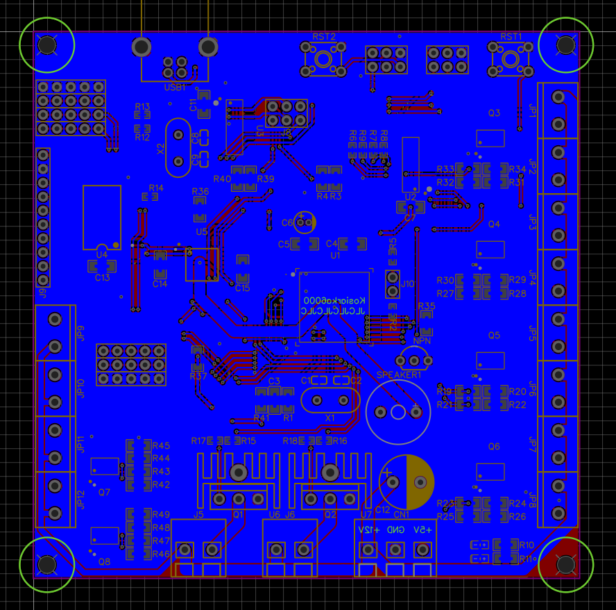

# DrinkCreator6000 – RTOS System on Custom AVR Board
DrinkCreator6000 is a real-time operating system (RTOS) project designed for a custom-built drink dispensing machine powered by an AVR microcontroller and FreeRTOS. The system is entirely based on static memory allocation for robustness and predictability, and integrates multiple hardware modules for a fully functional beverage control unit.

The machine is powered by a standard 400W ATX power supply, which provides stable 5V and 12V rails for the logic circuitry, Peltier cooling modules, and peristaltic pumps used for dispensing liquids. Pumps are controlled via a 74HC595 shift register, which expands digital output lines and drives MOSFET transistors to switch the high-current 12V loads safely and efficiently.

Temperature is regulated using Peltier elements coupled with an internal water cooling system, enclosed within the device chassis for thermal efficiency and thermal isolation.

User input is handled via a PCF8574N I²C I/O expander, which generates interrupts only when button states change — minimizing CPU load and improving responsiveness. System status, temperature data, and diagnostics are displayed on a 2004 character LCD screen driven over the I²C bus, allowing real-time monitoring directly from the front panel.

> 🔧 Status: In development  
> 🧪 Goal: Create a fully functional, physical drink machine and explore structured multi-tasking using FreeRTOS AVR MCU.

---

## 🧱 Project Structure

All logic is implemented in statically allocated FreeRTOS tasks running on a custom PCB with AVR hardware. The system is modular and designed to support precise debugging and future expansion.

## 🛠️ Hardware and Libraries Requirements

### Hardware
- ATmega2560 / ATmega2561 microcontroller — or an Arduino Mega board for prototyping convenience
- LCD 2004 display with I²C backpack (e.g., based on HD44780, PCA9633, or AiP31068)
- 74HC595 shift register for pump control
- PCF8574N I²C I/O expander for keypad

### Software
- Arduino IDE (used for development and uploading)
- Arduino FreeRTOS library (adds multitasking and RTOS features)
- LiquidCrystal_I2C library (compatible with the I²C LCD driver used)
- avr-libc (AVR C runtime, typically included with Arduino toolchain)

### 🧵 Task Overview

| Task ID | Task Name           | Description                                                                 |
|---------|---------------------|-----------------------------------------------------------------------------|
| 00      | `taskErrorHandler`  | Handles critical faults like stack overflows and logs errors to EEPROM.     |
| 01      | `taskStackDebugger` | Monitors stack and RAM usage across all tasks.                             |
| 02      | `taskMain`          | Coordinates the system, manages high-level logic, and activates tasks.      |
| 03      | `taskUpdateScreen`  | Periodically updates the LCD with system data (RAM, uptime, diagnostics).   |
| 04      | `taskRegulateTemp`  | Controls heating/cooling to maintain the target fluid temperature.          |
| 05      | `taskReadInput`     | Handles input devices like buttons or encoders and passes events to the main task. |
| 06      | `taskSelectDrink`   | Displays the current drink selection and related status.                    |
| 07      | `taskOrderDrink`    | Processes drink orders and manages state transitions for dispensing.        |
| 08      | `taskShowInfo`      | Displays error details on the LCD after a system reset due to failure.      |
| 09      | `taskShowTemp`      | Shows the current measured temperature on the LCD.                         |
| 10      | `taskShowLastError` | Presents recent errors, task states, and priority information on the LCD.  |
| 11      | `taskSim` | Simulates keyboard input by reading data from the serial interface. (used for testing)|
---

### 📊 RAM Usage Overview (Start, End, Size)

| Region    | Start Address | End Address | Size (bytes) |
|-----------|---------------|-------------|--------------|
| .data     | 0x0200        | 0x1522      | 4898         |
| .bss      | 0x1522        | 0x1BF7      | 1749         |
| Heap      | 0x1BF7        | 0x1BF7      | 0            |
| CPU Stack | 0x21B5        | 0x21FF      | 154          |

**Total free memory:** 1470 bytes

*Note:*  
- FreeRTOS task stacks are statically allocated and included in the `.data` segment size.  
- CPU Stack refers to the main processor stack (not individual task stacks).

### 💾 EEPROM Memory Map

| Address (hex) | Size (bytes) | Description                       |
|---------------|--------------|-----------------------------------|
| 0x0000        | 1            | Number of drinks in memory (n)    |
| 0x0001        | 34 * n       | Drinks data (n ≤ 26)              |
| 0x0400        | 4            | Temperature set in freezer        |
| 0x0404        | 4            | Temperature hysteresis width      |
| 0x0800        | 134          | Last saved error                  |
| 0x0C00        | 2            | Bootups count                     |

---

## 🧠 Design Goals

- 🎯 Explore real-time scheduling and modular task separation
- 💾 Use 100% static memory allocation (no malloc, no heap)
- 🧰 Track system stability via runtime task/memory debug tools
- 🔁 Ensure recovery after failure using EEPROM fault logging
- 📟 Provide full system visibility through LCD diagnostics and monitoring
- 🧪 Serve as a practical testbed for FreeRTOS and embedded RTOS design
- 📚 Designed as an educational project to deepen understanding of multitasking, resource sharing, and fail-safe system design in bare-metal embedded systems
- 🧩 Implement low-level memory management techniques for optimized and reliable resource control

---

## 🗺️ Roadmap

- [X] Create custom PCB with AVR MCU and additional components
- [X] Create functions for static allocation of Queues, Mutexes, and Semaphores
- [X] Create function for displaying current RAM usage via serial monitor
- [X] Create function for debugging the last unconfirmed error stored in EEPROM
- [X] Create function for displaying the boot count from EEPROM via serial port
- [X] Create stackOverflowHook for handling stack overflow errors
- [X] Create task for handling critical system errors such as stack overflows and logging them to EEPROM
- [X] Create task for debugging stack usage and runtime status of all tasks via serial monitor
- [ ] Create main task for coordinating other tasks
- [X] Create task for handling regular LCD updates
- [X] Create task for regulating temperature inside the freezer
- [ ] Create task for handling keyboard input from PCF8574 with software debounce
- [ ] Create task for selecting the drink to be ordered
- [ ] Create welcome screen task to display a greeting message with project name, version, and boot count on the LCD at system startup
- [ ] Create task for processing the ordered drink (pump activation)
- [X] Create task to display project information such as author, startup count, and current runtime
- [ ] Create task to display current temperature settings and actual temperature inside the freezer
- [ ] Create task to display and confirm the last saved error
- [X] Implement software guard zones between task stacks for added protection and reliability
- [ ] Review .map file and optimize memory by efficient variable placement using linker script (.ld file)
- [ ] Separate code into multiple files for better readability

---

## 🖼️ Visual Overview

This section provides an overview of the DrinkCreator6000 machine itself — including its hardware design, PCB layout, electrical schematics, and LCD interface examples.

#### 🧩 PCB Layout  
Preview of the custom-designed AVR board used in the project:

#### 🔧 Electrical Schematic  
Full schematic of the system, including MCU, Peltier drivers, shift register control, keypad interface, and LCD wiring:

### 📟 LCD Interface Screenshots

Below are snapshots of the 2004 LCD display during system operation, illustrating various interface states and views:

| ID | Screen               | Description                                                                 |
|----|----------------------|-----------------------------------------------------------------------------|
| 0  | **Startup Screen**    | Displays the project name, firmware version, and boot count.               |
| 1  | **Drink Select Screen** | Shows the current drink name, ingredients, and related info.              |
| 2  | **Drink Order Screen**  | Displays dispensing progress, drink name, and ETA.                        |
| 3  | **Show Info Screen**    | Displays uptime, project name, author, firmware version, and boot count.  |
| 4  | **Show Temp Info Screen**    | Displays current temperature inside the freezer and temperature settings|
| 5  | **Show RAM Info Screen**    | Displays current RAM usage (.data, .bss, heap, stack and free memory left)  |
| 6  | **Show Stack Size Screen**    | Displays stack free space, name, priority, id and state for every task in the project  |
| 7  | **Show Last Error Screen**    | Displays last unconfirmed error stored in EEPROM  |

Screen transition diagram:

          +-------------+
          | 0 Welcome   |
          +------+------+
                 |
                 v
          +-------------+  
          | 1 Drink     |  (scrollable)
          | Select      |
          +------+------+
             /       \
            v         v
      +-------------+  +-------------+
      | 2 Drink     |  | 3 Show      |
      | Order       |  | System Info |
      +-------------+  +------+------+
                              |
                              v
                      +-------------+
                      | 4 Show Temp |  (editable)
                      | Info        |
                      +------+------+
                             |
                             v
                      +-------------+
                      | 5 Show RAM  |  (scrollable)
                      | Info        |
                      +------+------+
                             |
                             v
                      +-------------+
                      | 6 Show Stack|  (scrollable)
                      | Size        |
                      +-------------+
                             |
                             v
                      +-------------+
                      | 7 Show Last |  (scrollable)
                      | Error       |
                      +-------------+
---

### 🎬 Live Demo
