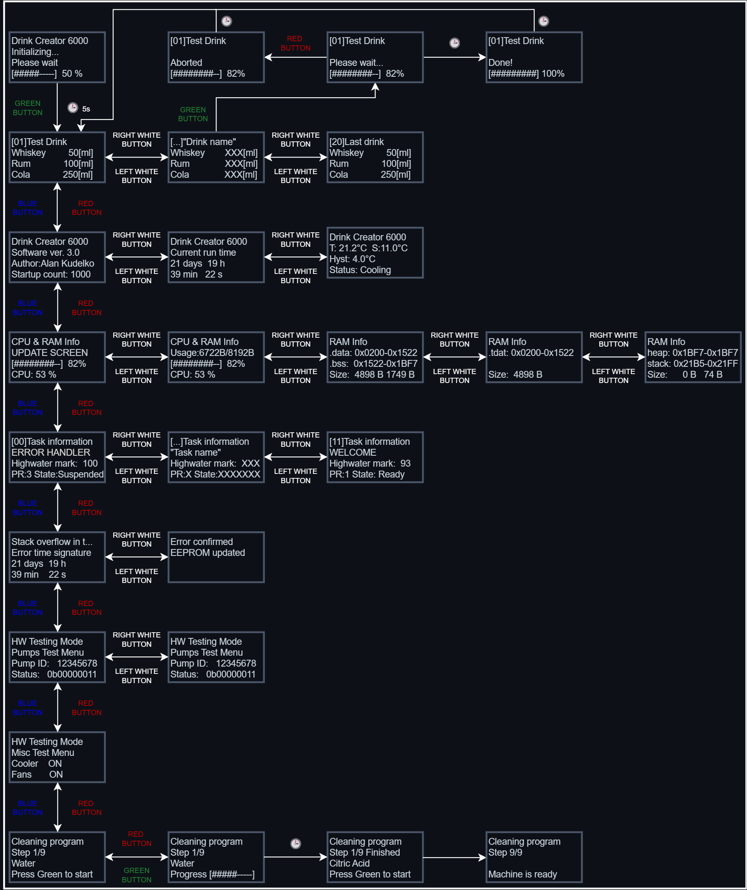
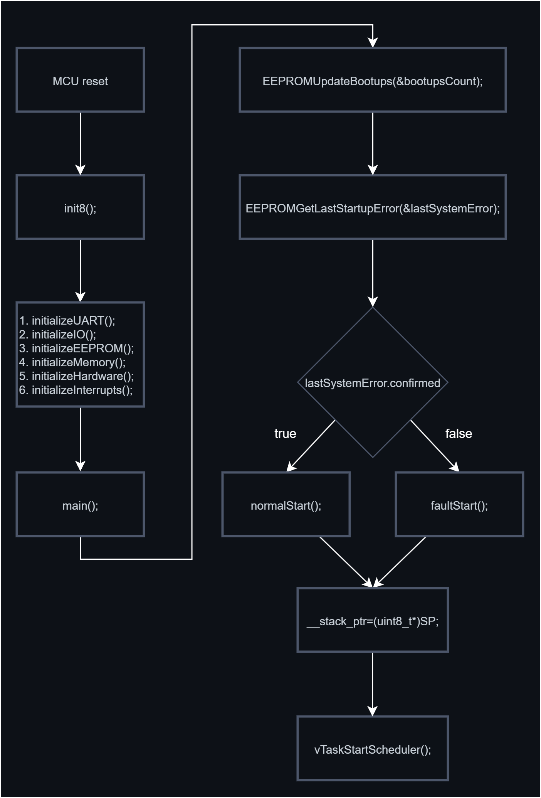
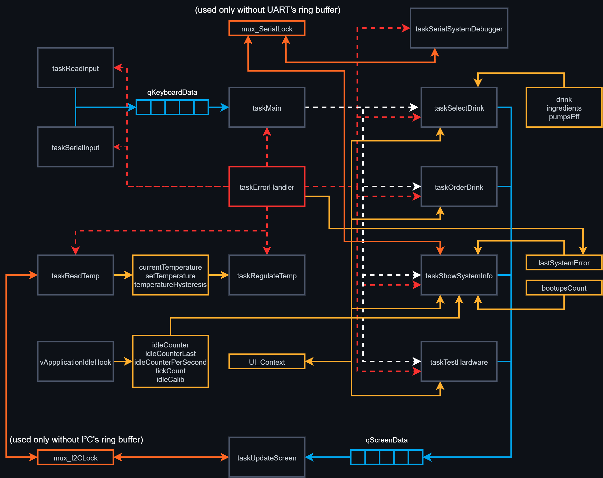

DrinkCreator6000 is a custom-built, FreeRTOS-based drink dispensing system that runs on an ATmega2561 AVR microcontroller mounted on a custom-made PCB. The entire system has been engineered from scratch, combining real-time software, robust hardware design, and a structured task-based architecture.

The project runs under FreeRTOS with fully static memory allocation, ensuring high predictability and resilience. A custom memory section .tdat, defined in the linker script, is used to allocate all task stacks and their associated guard zones contiguously in SRAM, enabling precise monitoring and deterministic stack overflow detection.

The project was initially prototyped using the Arduino framework and libraries, but it has since been fully migrated to a clean AVR environment with custom low-level drivers. It is now built with Visual Studio Code, CMake, and the avr-gcc toolchain, providing full transparency and hardware control. The firmware is also being refactored to comply with the MISRA C:2025 standard, improving safety, readability, and long-term portability.

The user interface is presented on a 20x4 character LCD driven via I²C, featuring a multi-screen menu for navigating functions such as drink selection, system diagnostics, and memory usage. Input comes from both a physical keypad connected through an MCP23008 I²C I/O expander and the UART interface, providing full control locally or remotely.

The system provides runtime diagnostics for RAM, task stack monitoring, and last-error reporting stored in EEPROM. These diagnostics are available in real time over UART and through a dedicated LCD submenu. A dedicated error-handling task monitors stack guard zones to detect overflows or memory corruption. On fault detection, the system logs detailed error data to EEPROM and displays it on both the LCD and UART. An automatic restart after a defined timeout is planned as a future feature.

Temperature sensing is handled via a 1-Wire digital thermometer, with data acquisition delegated to an ATmega328P configured as an I²C slave. The main ATmega2561 MCU retrieves temperature data over I²C, avoiding the strict timing requirements of the 1-Wire protocol that could otherwise block the FreeRTOS scheduler. Internal cooling is provided by two Peltier elements, a circulating pump, and a dedicated aluminum heat sink system. The cooling chamber is fully enclosed in polystyrene foam and lined with sealed aluminum sheets, making it waterproof and thermally isolated.

The system supports dedicated hardware test functions for verifying pumps, Peltier modules, and the circulation system. These tests can be run interactively from the keypad or via UART commands, enabling quick diagnostics during development and ensuring that all subsystems can be validated without running a full drink-dispensing cycle.

The entire unit is powered by a modified ATX computer power supply, delivering stable 5V and 12V rails for logic and high-current subsystems.

> 🔧 Status: In development  
> 🧪 Goal: Create a fully functional, physical drink machine and explore structured multi-tasking using FreeRTOS AVR MCU.

---

## ✳️ Technologies & Tools

This project integrates a wide range of hardware, software, and system-level concepts typically found in professional embedded systems. Below is a breakdown of the core technologies and components involved in the design and implementation of DrinkCreator6000:

### 🔌 Hardware & Electronics
- Custom PCB with ATmega2561 AVR MCU – Main microcontroller managing all system functions
- ATmega328P as I²C Slave – Co-microcontroller responsible for reading temperature from a 1-Wire digital thermometer
- MCP23008 I²C I/O expander - for keypad handling
- 74HC595 shift register - Controls peristaltic pumps by converting serial signals to parallel outputs
- 20x04 I²C LCD display for UI rendering
- Peltier Modules with Water Circulation Pump – Provide cooling for the chamber, supported by a dedicated circulation pump.
- 1-Wire digital thermometer - Monitors internal temperature of the cooling chamber
- Modified 400 W ATX power supply - Supplies stable 5V and 12V rails for logic circuits and high-power components
- Fully enclosed, thermally insulated cooling chamber - Constructed from polystyrene with sealed aluminum lining for waterproofing and thermal isolation

### 🧠 System Architecture & Concepts
- Real-time system based on FreeRTOS
- Static memory allocation only — no malloc, no heap fragmentation
- Custom linker script with a dedicated .tdat memory section for task stacks and guard zones
- Preemptive multitasking with structured task separation
- Guard zone-based stack overflow detection
- EEPROM-based error logging and system state preservation
- Soft watchdog / recovery logic (planned restart on fatal fault)

### 💬 Input / Output Interfaces
- UART serial interface for remote monitoring, control, and debugging
- I²C bus for LCD and keypad communication
- Dual input support: physical keypad and UART commands for full UI navigation
- Multi-level LCD menu system for selecting drinks, viewing diagnostics, and testing hardware

### 🧰 Development Tools & Libraries
- C / C++ for firmware
- Native AVR libraries (avr-libc, low-level register access)
- FreeRTOS (AVR port)
- VS Code, CMake, Ninja
- Doxygen for automatic code documentation
- Firmware is being gradually refactored to comply with the MISRA C:2025 standard to improve code safety, readability, and long-term maintainability

### 📚 Documentation
The source code is fully documented using Doxygen, which generates up-to-date, browsable documentation from the annotated source files. The generated docs can be found in the docs/ directory and are updated as part of the build process.

---

## 🧠 Design Goals

- 🎯 Explore real-time scheduling and modular task separation
- 💾 Use 100% static memory allocation (no malloc, no heap)
- 🧰 Track system stability via runtime task/memory debug tools
- 🔁 Ensure recovery after failure using EEPROM fault logging
- 📟 Provide full system visibility through LCD diagnostics and monitoring
- 🧪 Serve as a practical testbed for FreeRTOS and embedded RTOS design
- 📚 Designed as an educational project to deepen understanding of multitasking, resource sharing, and fail-safe system design embedded systems
- 🧩 Implement low-level memory management techniques for optimized and reliable resource control
- 🧱 Integrate tightly with custom hardware (PCB, sensors, pumps, display)
- 🕒 Guarantee deterministic execution and timing across tasks

---

## 🖼️ Visual Overview

This section provides a visual presentation of the DrinkCreator6000 project, including photographs of the assembled machine, its hardware components, and screenshots illustrating the system’s operation. It aims to deliver a comprehensive understanding of the device’s physical design and functional behavior.

### 🎬 UI Demos

---

## 📟 UI Flow & Screens

| ID | Screen               | Description                                                                 |
|----|----------------------|-----------------------------------------------------------------------------|
| 0  | **Welcome Screen**    | Displays the project name, firmware version, and boot count.               |
| 1  | **Drink Select Screen** | Shows the current drink name, ingredients, and related info.              |
| 2  | **Drink Order Screen**  | Displays dispensing progress, drink name, and ETA.                        |
| 3  | **Show Info Screen** | Displays general system status including uptime, firmware version, boot count, author, freezer temperature, RAM usage, and task stack diagnostics. |
| 4  | **Show Task Stack Info Screen** | Displays detailed information about FreeRTOS task stacks, including task names, priorities, and high-water marks (minimum remaining stack). |
| 5  | **Show Last Error Screen**    | Displays last unconfirmed error stored in EEPROM  |

Screen transition diagram:
     

---

## 🗺️ Roadmap

- ✅ Create custom PCB with AVR MCU and additional components
- ✅ Create functions for static allocation of Queues, Mutexes, and Semaphores
- ✅ Create function for displaying current RAM usage via serial monitor
- ✅ Create function for debugging the last unconfirmed error stored in EEPROM
- ✅ Create function for displaying the boot count from EEPROM via serial port
- ✅ Create stackOverflowHook for handling stack overflow errors
- ✅ Create task for handling critical system errors such as stack overflows and logging them to EEPROM
- ✅ Create task for debugging stack usage and runtime status of all tasks via serial monitor
- ✅ Create main task for coordinating other tasks
- ✅ Create task for handling regular LCD updates
- ✅ Create task for regulating temperature inside the freezer
- 🔄 Create task for handling keyboard input from MCP23017 with software debounce
- 🔄 Create task for selecting the drink to be ordered
- ✅ Create welcome screen task to display a greeting message with project name, version, and boot count on the LCD at system startup
- 🔄 Create task for processing the ordered drink (pump activation)
- ✅ Create task to display project information such as author, startup count, and current runtime
- ✅ Implement software guard zones between task stacks for added protection and reliability
- ✅ Review .map file and optimize memory by efficient variable placement using linker script (.ld file)
- ✅ Create a custom memory segment named `.tdat` to store Task Control Blocks (TCBs), task stacks, and stack guard zones by modifying the linker script (.ld file)
- ✅ Implement a guard zone watchdog inside `taskErrorHandler` to detect guard zone corruption, indicating potential stack overflows
- ✅ Separate code into multiple files for better readability
- 🔄 Add EEPROM-based drink recipe loading at startup
- 🔄 Add automatic system reset after fatal system error (e.g. guard zone or memory corruption)
- 🔄 Implement `stopPumps()` function to safely disable all pump outputs
- 🔄 Implement `stopCooler()` function to safely disable the cooling system
- 🔄 Refactor embedded codebase to comply with MISRA C:2025 coding standard for improved safety, portability, and maintainability
- 🔄 Develop custom low-level UART and I2C drivers with queuing support, non-blocking read/write operations, and efficient MCU time usage
- ✅ Refactor project structure and clean up `#include` dependencies based on Doxygen documentation analysis
- ✅ Migrate project to VS Code, CMake, and Ninja build system with `avr-gcc` toolchain

---

## Technical Table of Contents

1. [Project Structure & File Overview](#1--project-structure--file-overview)
2. [Task Overview](#2--task-overview)
3. [System's architecture overview](#3-%EF%B8%8F-systems-architecture-overview)
   - [3.1 System Initialization `.init8`](#31-system-initialization-init8)
   - [3.2 System normal start](#32-system-normal-start)
   - [3.3 System fault start](#33-system-fault-start)
   - [3.4 Normal operation](#34-normal-operation)
4. [Navigation & UI Context](#4-navigation--ui-context)
5. [Low level drivers](#5-low-level-drivers)
   - [5.1 UART](#51-uart)
   - [5.2 I²C](#52-i²c)
6. [Input Handling & MCP23008](#6-input-handling--mcp23008)
   - [6.1 Configuration of MCP23008](#61-configuration-of-mcp23008)
   - [6.2 Reading data from MCP23008](#62-reading-data-from-mcp23008)
7. [Memory Layout](#7--memory-layout)
   - [7.1 EEPROM Map](#71-eeprom-map)
   - [7.2 RAM Map](#72-ram-map)
   - [7.3 Custom RAM Segments](#73-custom-ram-segments)
   - [7.4 Free Memory Calculation](#74-free-memory-calculation)
   - [7.5 RAM Usage Overview (Start, End, Size)](#75-ram-usage-overview-start-end-size)
8. [Electrical Schematic](#8--electrical-schematic)
   - [8.1 USB Port with UART converter for ATmega2561](#81-usb-port-with-uart-converter-for-atmega2561)
   - [8.2 ATmega2561](#82-atmega2561)
   - [8.3 Shift Register](#83-shift-register)
   - [8.4 Keyboard driver](#84-keyboard-driver)
9. [PCB](#9--pcb)
   - [9.1 MCU Pinout (TQFP-64 ATmega2561)](#91-mcu-pinout-tqfp-64-atmega2561)
   - [9.2 MCU Pinout (TQFP-32 ATmega328p)](#92-mcu-pinout-tqfp-32-atmega328p)
   - [9.3 Bill of Materials (BOM)](#93-bill-of-materials-bom)
   - [9.4 MOSFET Power Dissipation Calculations](#94-mosfet-power-dissipation-calculations)
   - [9.5 PCB Layout](#95-pcb-layout)
10. [Additional Notes](#10-additional-notes)
11. [How to build](#11--how-to-build)
   - [11.1 Installing VS Code](#111-installing-vs-code)
   - [11.2 Installing CMake](#112-installing-cmake)
   - [11.3 Installing Ninja as the build tool](#113-installing-ninja-as-the-build-tool)
   - [11.4 Installing AVR-GCC toolchain](#114-installing-avr-gcc-toolchain)
   - [11.5 Installing AVRDUDE for uploading the compiled firmware](#115-installing-avrdude-for-uploading-the-compiled-firmware)
   - [11.6 Building and uploading the project](#116-building-and-uploading-the-project)
  
---

## ⚙️ Technical Overview

### 1. 📦 Project Structure & File Overview

	📦 DrinkCreator6000/
 	│
 	├── Datasheets/      # Documentation of used ICs and components
	├── avr_peripherals/ # Low-level custom hardware drivers (UART, I2C, etc.)
	├── build/           # Build output directory (generated by CMake + Ninja)
	├── docs/            # Documentation generated by Doxygen
	├── FreeRTOS/        # FreeRTOS source files for AVR platform
	├── linker/          # Linker script and custom memory layout files
	├── include/         # Project header files (configuration, data types, tasks, etc.)
	│   ├── DrinkCreator6000_Config.h
	│   ├── DrinkCreator6000_DataTypes.h
	│   ├── DrinkCreator6000_EEPROM.h
	│   ├── DrinkCreator6000_Init.h
	│   ├── DrinkCreator6000_Pins.h
	│   ├── DrinkCreator6000_Progmem.h
	│   ├── DrinkCreator6000_RamStats.h
	│   └── ... (other header files)
	│
	├── src/             # C/C++ source files implementing application logic and FreeRTOS tasks
	│   ├── DrinkCreator6000.cpp
	│   ├── DrinkCreator6000_Config.cpp
	│   ├── DrinkCreator6000_Init.cpp
	│   ├── DrinkCreator6000_EEPROM.c
	│   ├── DrinkCreator6000_Progmem.c
	│   ├── DrinkCreator6000_RamStats.c
	│   └── ... (other source files)
	│
	├── tools/                # Helper tools, including the complete AVR toolchain (avr-gcc, avr-libc)
	│
	├── .vscode/              # Visual Studio Code configuration files
	│
	├── CMakeLists.txt        # CMake build system configuration
	├── build.ninja           # Build system file generated by CMake (Ninja backend)
	├── compile_commands.json # Compilation database for IDE integration
	├── Doxyfile              # Configuration file for Doxygen documentation generation
	├── LICENSE               # Project license file
	├── README.md             # Project overview and documentation
	├── .gitignore            # Git ignore configuration
	└── ... (other config and build files)

---

### 2. 🧵 Task Overview

| Task ID | Task Name                  | Description                                                                                                               | Priority | Stack Size | Free Stack |
|---------|----------------------------|---------------------------------------------------------------------------------------------------------------------------|----------|------------|------------|
| 00      | `taskErrorHandler`         | Handles critical faults such as stack overflows and guard zone corruption, and logs errors to EEPROM                      |    3     |    256     |     50     |
| 01      | `taskSerialSystemDebugger` | Monitors stack and RAM usage across all tasks and outputs the data to the serial port                                     |    1     |    270     |     47     |
| 02      | `taskMain`                 | Coordinates the system, manages high-level logic, activates tasks, and handles the current UI context                     |    1     |    200     |    129     |
| 03      | `taskReadInput`            | Reads keyboard data from the MCP23017 I²C I/O expander                                                                    |    2     |    150     |     75     |
| 04      | `taskSerialInput`          | Simulates keyboard input via the serial port for debugging or testing purposes                                            |    2     |    150     |     46     |
| 05      | `taskUpdateScreen`         | Periodically updates the LCD based on current context of the systems                                                      |    1     |    250     |     55     |
| 06      | `taskReadTemp`             | Reads the current temperature inside the freezer and updates a global variable                                            |    1     |    180     |    118     |
| 07      | `taskRegulateTemp`         | Regulates temperature based on the current readings and configured thresholds                                             |    1     |    180     |    118     |
| 08      | `taskSelectDrink`          | Handles drink selection logic and displays in on the LCD                                                                  |    1     |    270     |     95     |
| 09      | `taskOrderDrink`           | Controls the 74HC595 shift register and pump sequence when processing a drink order                                       |    1     |    320     |    175     |
| 10      | `taskShowSystemInfo`       | Displays various system statuses—RAM usage, temperature, task states, boot count, uptime, and last saved error—on the LCD |    1     |    300     |     80     |
| 11      | `taskWelcomeScreen`        | Displays a decorative welcome screen to give the system a more professional appearance                                    |    1     |    222     |     42     |
| 12      | `taskTestHardware`         | Allows for testing of individual pumps, cooling fan, Peltier elements (Not implemented yet)                               |    1     |    222     |      -     |

*Note:*  
- Task stacks will be fine-tuned in the final release
- The taskWelcomeScreen and taskTestHardware tasks share the same TCB and stack, as the former is deleted upon completion. This memory reuse is required due to limited available RAM (~800 bytes remaining) and provides a practical demonstration of task stack and TCB reuse in highly constrained memory environments

### 3. 🛠️ System's architecture overview

Startup sequence of the project

#### 3.1 System Initialization `.init8`

The project includes a dedicated initialization module responsible for preparing the system hardware and RTOS environment before normal operation begins.
- Configures all I/O pins according to the custom hardware design.
- Allocates memory statically for FreeRTOS objects such as tasks, queues, semaphores, and mutexes.
- Initializes key hardware peripherals including UART, I²C devices (e.g., LCD, keypad expanders), and shift registers for pump control.
- Implements a system startup routine that runs early during boot (placed in the `.init8` linker section), ensuring all components are ready before the scheduler starts.
- The startup routine is marked with GCC `naked` and `used` attributes to control exact placement and prevent unwanted optimizations or removal.

This initialization routine executes prior to main(), ensuring all hardware and RTOS structures are fully prepared before normal system operation. By placing the initialization in the dedicated .init8 linker section, main() remains simpler and less dependent on header files across the project.

#### 3.2 System normal start

During normal startup, all tasks are created and initialized according to the system design:

- `taskWelcomeScreen` executes briefly to present a decorative startup display
- Core tasks are created, including `taskMain`, `taskReadInput`, `taskUpdateScreen`, `taskReadTemp`, `taskRegulateTemp`, `taskSelectDrink`, and `taskOrderDrink`
- Peripheral tasks for serial input, system monitoring, and UI updates are also initialized
- The global `SystemContext` (FSM-based) is initialized to the `taskWelcomeScreen` context

This setup enables full system functionality, supporting both user interaction and automated beverage processing.

#### 3.3 System fault start

In case of a critical fault, the system performs a fault startup with a minimal set of tasks:

- The task that caused the fault is not created
- `taskWelcomeScreen` is non created
- The global `SystemContext` is set to display the last recorded fault, and all tasks except the one that caused the fault are initialized normally

This approach ensures safe recovery, prevents re-execution of the failing task, and provides immediate visibility of the fault.

After the tasks are created, `__stack_ptr` is set to the current SP value, the RTOS scheduler is started, and the system begins normal operation.

#### 3.4 Normal operation

During normal operation, the system uses queues, mutexes, notifications, global variables and semaphores to control information exchange between tasks. All control structures are listed below:

| Type                         | Name                  | Elements                      | Description |
|------------------------------|-----------------------|-------------------------------|-------------|
| Queue                        | qScreenData           | SCREEN_QUEUE_BUFFER_COUNT=2   | Queue for passing screen update data between tasks |
| Queue                        | qKeyboardData         | KEYBOARD_QUEUE_BUFFER_COUNT=2 | Queue for keyboard/input events |
| Queue                        | qErrorId              | ERROR_ID_QUEUE_BUFFER_COUNT=1 | Queue for error IDs to be processed/logged |
| Mutex                        | mux_I2CLock           | N/A                           | Mutex protecting access to I²C bus |
| Mutex                        | mux_SerialLock        | N/A                           | Mutex protecting access to UART/serial port |
| Volatile struct sUIContext   | UI_Context            | N/A                           | Global UI context structure managing screen/task states |
| struct sSystemError          | lastSystemError       | N/A                           | Structure containing information and time signature of last system's error |
| uint16_t                     | bootupsCount          | N/A                           | BootupCount of the system |
| float                        | currentTemperature    | N/A                           | Current temperature inside the freezer |
| float                        | setTemperature        | N/A                           | Regulation set temperature for the freezer |
| float                        | temperatureHysteresis | N/A                           | Hysteresis width of temperature regulation|
| const struct sDrinkData[]    | drink                 | N/A                           | Drinks data, name, volumes |
| const char[]                 | ingredients           | N/A                           | Names of ingredients used for creating drinks |
| const uint8_t[]              | pumpsEff              | N/A                           | Pumps efficiency values (may require manual calibration for different beverages) |

During normal operation, tasks communicate as illustrated in the diagram below.

*Note:*  
- 🟦 **Blue** – Queues (`QueueHandle_t`)  
- 🟨 **Yellow** – Global variables  
- ⬜ **White, dashed lines** – Task notifications
- 🟥 **Red, dahsed lines** – Task notifications
- 🟧 **Orange** – Mutexes (`MutexHandle_t`)  

During normal operation, `taskMain` coordinates other tasks based on the global context variable UI_Context. It issues task notifications to trigger activation and suspension of specific tasks as required by the current state.

If a fault is detected by `taskErrorHandler`, all running tasks are immediately suspended, the fault record is written to EEPROM, and the system performs a restart to ensure safe recovery.

Global variables do not require protection through mutexes or semaphores, since they are not critical for the stability of the system. The `UI_Context` structure is also not protected, as all operations on it are atomic—ensuring that all fields of the structure are written simultaneously. Moreover, tasks never modify the field that determines the currently active task; instead, they only update fields related to their respective submenus. If any submenu field contains an invalid (out-of-range) value, it is automatically reset to a default value within the currently executing task. This situation can only occur during switching of the currently running task and results in the worst case in displaying the first submenu of the running task.

---

### 4. Navigation & UI Context  

Navigation within the user interface is managed through a global volatile structure named UI_Context. This structure enables switching between different tasks by activating or deactivating them as necessary. The core control and navigation logic is implemented in the taskMain function.

The UI_Context structure is defined as follows:

    UI_Context{
      uint8_t autoScrollEnable: 1;  // Enables (1) or disables (0) auto-scrolling of the submenu
      uint8_t currentTask: 3;       // Currently active task bound to the LCD (0 – 7)
      uint8_t currentMenu: 3;       // Currently selected menu within the task (0 – 7)
      uint8_t currentSubMenu;       // Currently selected submenu (0 - 255)
    }

This structure stores information about the currently active task — the task responsible for updating the LCD by sending data via a queue to taskUpdateScreen(). It also tracks the currently selected menu and submenu within that task, providing a flexible and memory-efficient mechanism for UI navigation.

When a button is pressed (or a command is simulated via the serial port), taskMain evaluates whether a context switch is necessary. If so, it sends a task notification with a specific value (0 or 1) indicating whether the task should be deactivated or activated.

Upon receiving a deactivation notification, the affected task safely stops its execution. Then, taskMain updates the UI_Context accordingly and notifies the new task to begin its operation.

An example of this control logic is shown below:

    if((*keyboardInput&E_GREEN_BUTTON)==E_GREEN_BUTTON){
      taskENTER_CRITICAL();
      UI_Context->currentTask=DRINK_ORDER;
      UI_Context->currentMenu=0;
      UI_Context->currentSubMenu=0;
      taskEXIT_CRITICAL();
    }
    if((*keyboardInput&E_LWHITE_BUTTON)==E_LWHITE_BUTTON){
      UI_Context->currentSubMenu--;
      xTaskNotify(taskHandles[TASK_SELECT_DRINK],1,eSetValueWithOverwrite);
    }
    if((*keyboardInput&E_RWHITE_BUTTON)==E_RWHITE_BUTTON){
      UI_Context->currentSubMenu++;
      xTaskNotify(taskHandles[TASK_SELECT_DRINK],1,eSetValueWithOverwrite);
    }
    if((*keyboardInput&E_BLUE_BUTTON)==E_BLUE_BUTTON){
      taskENTER_CRITICAL();
      UI_Context->currentTask=SHOW_INFO;
      UI_Context->currentMenu=0;
      UI_Context->currentSubMenu=0;
      taskEXIT_CRITICAL();
      xTaskNotify(taskHandles[TASK_SHOW_SYS_INFO],1,eSetValueWithOverwrite);
      xTaskNotify(taskHandles[TASK_SELECT_DRINK],0,eSetValueWithOverwrite);
    }
    
*Note:*  
- When modifying multiple fields of the UI_Context structure, it is crucial to ensure the operation is "atomic". This means preventing context switches by the scheduler during the update (e.g., by entering a critical section). Without proper protection, concurrent access to UI_Context by multiple tasks may lead to inconsistent states or subtle race conditions that are difficult to debug.

---

### 5. Low level drivers

#### 5.1 UART

#### 5.2 I²C

---

### 6. Input Handling & MCP23008  

#### 6.1 Configuration of MCP23008

The MCP23008 is a 8-bit I/O expander IC that provides additional GPIO pins via an I²C interface. It features 11 registers that enable control of 8 pins. Its primary advantage lies in its ability to expand the number of input and output lines available to a microcontroller.

However, this IC was selected due to its inclusion of two interrupt pin, which can be utilized to signal when a button press occurs. Moreover, it maintains the previous button states within dedicated registers, allowing the interrupt to be serviced at a later time without the need for immediate response. The stored button states persist until the data is read from the device, ensuring no input events are lost.

#### 6.2 Reading data from MCP23008

Button input handling is implemented using a dedicated FreeRTOS task, which waits on a binary semaphore. This semaphore is released by an interrupt service routine (ISR) whenever the MCP23008 triggers a change on INTA. This design ensures that input processing is deferred from the ISR context, minimizing interrupt latency and preserving real-time responsiveness.

When the semaphore is acquired, the task reads the INTCAP (Interrupt Capture) registers, which store the latched state of Port at the exact moment the interrupt occurred. This guarantees that no input event is lost — even if there's a delay between the interrupt and task execution.

The input algorithm implements:

Debouncing: Each press is verified against the real-time GPIOx registers. If the state persists across several iterations, it's accepted as valid.

Hold detection: A button is considered “held” if the value read from INTCAPx matches the current state in GPIOx for a given number of cycles, with delays between checks.

Active-low logic: All inputs are configured as active-low, with internal pull-ups enabled in the MCP23008. A LOW signal indicates a button press.

Deferred execution: No I²C communication occurs inside the ISR. Instead, the ISR only sets the read flag, and the task performs all data handling asynchronously.

This approach provides reliable short-press and long-press detection without the risk of input events being missed. It also ensures that system timing and stability are preserved even under frequent user interaction.

---

### 7. 💾 Memory Layout

#### 7.1 EEPROM Map

| Address (hex) | Size (bytes) | Description                       |
|---------------|--------------|-----------------------------------|
| 0x0000        | 1            | Number of drinks in memory (n)    |
| 0x0001        | 34 * n       | Drinks data (n ≤ 26)              |
| 0x0400        | 4            | Temperature set in freezer        |
| 0x0404        | 4            | Temperature hysteresis width      |
| 0x0800        | 135          | Last saved error                  |
| 0x0C00        | 2            | Bootups count                     |

#### 7.2 RAM Map

- `__data_start` is a linker symbol representing the starting address of the `.data` section in SRAM on AVR microcontrollers.
- `__data_end` is a linker symbol representing the ending address of the `.data` section in SRAM on AVR microcontrollers.
- `__bss_start` is a linker symbol representing the starting address of the `.bss` section in SRAM on AVR microcontrollers.
- `__bss_end` is a linker symbol representing the ending address of the `.bss` section in SRAM on AVR microcontrollers.
- `__tdat_start` is a linker symbol representing the starting address of the `.tdat` section in SRAM.
- `__tdat_end` is a linker symbol representing the ending address of the `.tdat` section in SRAM.
- `__heap_start` is a linker symbol representing the starting address of the heap section in SRAM.
- `__heap_end` is a C variable defined by me to represent the current end of the heap. Its value is calculated at runtime (see Notes below).
- `__stack_ptr` is a C variable defined by me to capture the initial value of the stack pointer before the RTOS scheduler starts (see Notes below).
- `RAMEND` is a predefined constant representing the last address of SRAM on AVR microcontrollers. For the ATmega2561 used in this project, `RAMEND` is equal to `0x21FF`.

*Note:*
- The `.tdat` section is a custom memory segment defined in the linker script. It is used to store Task Control Blocks (TCBs), task stacks, and associated guard zones. By placing all task stacks contiguously within .tdat, the system ensures controlled stack allocation and simplifies stack overflow detection.
- The symbols `__tdat_start` and `__tdat_end` were predefined in the linker script, along with a custom `.tdat` section. This section is used to store Task Control Blocks (TCBs), task stacks, and corresponding guard zones. The `.tdat` section ensures that stacks and their guard zones are placed contiguously in memory, enabling reliable stack overflow monitoring.
- The `__heap_end` variable is computed as:
  
      __heap_end = (__brkval != 0) ? __brkval : (void*)&__heap_start;
  
- `__brkval` is a pointer internally managed by malloc() to indicate the current top of the heap. If no memory has been allocated yet, it remains zero.
- The `__stack_ptr` variable is initialized with the value of the `SP` register before the RTOS scheduler starts. On AVR microcontrollers, `SP` holds the current stack pointer. However, after the scheduler starts, `SP` is overwritten with the stack pointer of the currently executing task, which would lead to incorrect free memory calculations if used directly.

#### 7.3 Custom RAM Segments

When compiling a program, the linker is responsible for placing variables and code into the correct memory segments — for example, initialized variables go into the `.data` section, uninitialized variables into `.bss`, and so on. This process is usually handled automatically by the default linker script.

However, relying solely on the default script does not guarantee that specific variables will be placed contiguously in memory. Their placement can vary depending on factors such as the order of .o files passed to the linker.

To ensure that all data related to each task — specifically the Task Control Block (TCB), task stack, and its corresponding guard zone — are placed contiguously in memory, I defined a custom .tdat memory section. This section is further divided into subsections, one for each stack and guard zone. This layout allows for reliable and predictable stack overflow detection, as a dedicated task can systematically inspect each guard zone to verify memory integrity.

I chose to manually assign each guard zone and task stack to its own subsection in the linker script to ensure strict ordering and prevent unexpected memory layout issues. This eliminates any ambiguity and guarantees that variables appear exactly where intended in SRAM.

This configuration is reflected in the following linker script fragment:

    .tdat (NOLOAD) :
    {
	. = ALIGN(1);
	PROVIDE (__tdat_start = . );
	
	KEEP(*(.tdat.guardZone0));	
	KEEP(*(.tdat.errorHandlerStack));	
	KEEP(*(.tdat.guardZone1));	
	KEEP(*(.tdat.serialSystemDebuggerStack));	
	KEEP(*(.tdat.guardZone2));	
	KEEP(*(.tdat.mainStack));	
	KEEP(*(.tdat.guardZone3));	
	KEEP(*(.tdat.readInputStack));	
	KEEP(*(.tdat.guardZone4));	
	KEEP(*(.tdat.serialInputStack));	
	KEEP(*(.tdat.guardZone5));	
	KEEP(*(.tdat.updateScreenStack));	
	KEEP(*(.tdat.guardZone6));	
	KEEP(*(.tdat.readtempStack));	
	KEEP(*(.tdat.guardZone7));	
	KEEP(*(.tdat.regulateTempStack));	
	KEEP(*(.tdat.guardZone8));	
	KEEP(*(.tdat.selectDrinkStack));	
	KEEP(*(.tdat.guardZone9));	
	KEEP(*(.tdat.orderDrinkStack));	
	KEEP(*(.tdat.guardZone10));	
	KEEP(*(.tdat.showSystemInfoStack));
	KEEP(*(.tdat.guardZone11));
	KEEP(*(.tdat.welcomeScreenStack));
	
	KEEP(*(.tdat))
	KEEP(*(.tdat*))
	PROVIDE (__tdat_end = . );
    }
    
Below is an example of how a guard zone and a task stack are declared in code:

    volatile StackType_t guardZone0[GUARD_ZONE_SIZE]              __attribute__((section(".tdat.guardZone0")));

    StackType_t errorHandlerStack[TASK_ERROR_HANDLER_STACK_SIZE]  __attribute__((section(".tdat.errorHandlerStack")));

*Note:*
- Each guard zone is declared as volatile to ensure the compiler does not optimize away accesses or overwrite them unexpectedly. Since these memory regions are checked explicitly in software for integrity (e.g., to detect overflow), they must always be preserved exactly as written in memory. Marking them as volatile prevents the compiler from assuming they remain unchanged or unused.

After compiling and inspecting the .map file, I confirmed that the .tdat section is correctly placed in SRAM. All subsections appear in the exact order defined in the linker script, starting from `__tdat_start`. Each stack and guard zone is properly aligned and located contiguously, which is essential for deterministic overflow detection logic.

    .tdat           0x008010e8      0xe97
                    0x008010e8                . = ALIGN (0x1)
                    0x008010e8                PROVIDE (__tdat_start, .)
    *(.tdat.guardZone0)
    .tdat.guardZone0
                    0x008010e8      0x20  C:\Users\kujon\AppData\Local\Temp\ccjR9wYB.ltrans0.ltrans.o
    *(.tdat.errorHandlerStack)
    .tdat.errorHandlerStack
                    0x00801108      0x100 C:\Users\kujon\AppData\Local\Temp\ccjR9wYB.ltrans0.ltrans.o
    *(.tdat.guardZone1)
    .tdat.guardZone1
                    0x00801208      0x20  C:\Users\kujon\AppData\Local\Temp\ccjR9wYB.ltrans0.ltrans.o

#### 7.4 Free Memory Calculation  

Free memory calculation is straightforward on AVR microcontrollers.

The stack starts at `RAMEND` and grows downward. Its current position is captured in the `__stack_ptr` variable, which holds the value of the `SP` (Stack Pointer) register before the RTOS scheduler is started.

The heap begins at `__heap_start`, which is the first available address after global and static data sections (`.data`, `.bss`, and `.tdat`) are initialized. It grows upward, with its current boundary given by `__heap_end`.

Therefore, the amount of free memory available in the system is calculated as:

    Free memory = __stack_ptr - __heap_end

#### 7.5 RAM Usage Overview (Start, End, Size)

| Region    | Start Address | End Address | Size (bytes) |
|-----------|---------------|-------------|--------------|
| .data     | 0x0200        | 0x0B08      | 2312         |
| .bss      | 0x0B08        | 0x10AC      | 1444         |
| .tdat     | 0x10AC        | 0x1EB0      | 3588         |
| Heap      | 0x1BF7        | 0x1BF7      | 0            |
| CPU Stack | 0x21B5        | 0x21FF      | 154          |

**Total free memory:** 836 bytes

*Note:*  
- FreeRTOS task stacks are statically allocated and included within the `.tdat` segment.
- The CPU Stack refers to the main processor stack (used before the scheduler starts), not individual task stacks.
  
---

### 8. 🔌 Electrical Schematic  
Full schematic of the system, including MCU, Peltier drivers, shift register control, keypad interface, and LCD wiring:

#### 8.1 USB Port with UART converter for ATmega2561

**USB Port with UART Converter (CH340G)** — Provides USB connectivity to the ATmega2561 through an integrated CH340G USB-to-UART bridge. Used mainly for debugging, and testing via a virtual COM port.

#### 8.2 ATmega2561

**ATmega2561 Microcontroller Module** — Central microcontroller of the board. Features include:  
- Decoupling capacitors for stable power supply filtering.  
- Connection to an external crystal oscillator with its load capacitors for precise clocking.  
- Reset button for manual reset of the MCU.
- Labeled “nets” for organized signal routing in EasyEDA.
- Diagnostic LED connected to the SCK pin (PB5), used for basic status indication or debugging.

This module serves as the main processing unit in the project, handling all digital I/O, communication, and control tasks.

#### 8.3 Shift Register

**74HC595 Shift Register** — Serial-in, parallel-out shift register used to control the drink-dispensing pumps.
- Decoupling capacitor for stable power supply filtering.  
- Receives serial data from the microcontroller and converts it to parallel outputs.  
- Each output is connected to the gate of a MOSFET that switches an individual pump. 

#### 8.4 Keyboard driver

**MCP23008 I²C GPIO Expander** — Used as the keyboard controller.  
- Communicates with the microcontroller via the I²C bus.  
- The **INT pin** signals when new keypress data is available.  
- An external pull-up resistor is connected to the INT pin.  
- Internal pull-ups on the GPIO pins can be enabled via the MCP23008 configuration registers, so no external pull-ups are needed for the keyboard lines.  
- Reads the status of the keys and provides it to the microcontroller for processing.

---

### 9. 🧩 PCB

#### 9.1 MCU Pinout (TQFP-64 ATmega2561)

| Pin | Usage |
|-----|-------|
| PE0 (RXD0/PCINT8)  | 🟢 USART0 RX / ICSP Serial Data in |
| PE1 (TXD0)         | 🟢 USART0 TX / ICSP Serial Data out |
| PE3 (OC3A/AIN1)    | 🟢 Radiator fan 1 MOSFET's gate |
| PE4 (OC3B/INT4)    | 🟢 Radiator fan 2 MOSFET's gate |
| PE5 (OC3C/INT5)    | 🟢 Cooler fan MOSFET's gate |
| PE6 (T3/INT6)      | 🟢 Circulation pump MOSFET's gate |
| PB1 (SCK/PCINT1)   | 🟢 ICSP Serial Clock |
| PB5 (OC1A/PCINT5)  | 🟢 Buzzer NPN's base |
| PB6 (OC1B/PCINT6)  | 🔴 Open Drain Slave Data Ready |
| PC0 (A8)           | 🟢 74HC595 Serial data input |
| PC1 (A9)           | 🟢 74HC595 Storage register clock input |
| PC2 (A10)          | 🟢 74HC595 Shift register clock input |
| PC3 (A11)          | 🟢 74HC595 Output enable (active LOW) |
| PC4 (A12)          | 🟢 LED Ring DI |
| PC5 (A13)          | 🟢 LED Ring DO |
| PD0 (SCL/INT0)     | 🔵 I2C SCL |
| PD1 (SDA/INT1)     | 🔵 I2C SDA |	
| PD2 (RXD1/INT2)    | 🟢 MCP23008 INT |
| PD3 (TXD1/INT3)    | 🟢 MCP23008 RESET |
| PD4 (ICP1)         | 🟢 Peltier element 1 MOSFET's gate |
| PD5 (XCK1)         | 🟢 Peltier element 2 MOSFET's gate |
| PD6 (T1)           | 🟢 LED Ring DI |
| PD7 (T0)           | 🟢 LED Ring DO |

*Note:*  
- Timer usage in the system:
  - **Timer1** drives the buzzer output on pin **PB5**, enabling PWM control for generating sound frequencies.  
  - **Timer2** is used by FreeRTOS for the system tick. This provides a precise periodic interrupt to drive task scheduling and timing functions.  
  - **Timer4** is dedicated to the custom I²C driver with ring buffer support, allowing non-blocking I²C communication. The timer triggers interrupts for handling I²C events, so CPU time is not blocked during transfers.  

#### 9.2 MCU Pinout (TQFP-32 ATmega328p)

| Pin | Usage |
|-----|-------|
| PD0 (RXD)          | 🟢 USART0 RX |
| PD1 (TXD)          | 🟢 USART0 TX |
| PB0 (ICP1/CLKO)    | 🔴 Open Drain Slave Data Ready |
| PB1 (OC1A)         | 🟢 1-WIRE interface |
| PB2 (SS/OC1B)      | ⚪ Unused |
| PB3 (MOSI/OC2A)    | 🟢 ICSP Serial Data in |
| PB4 (MISO)         | 🟢 ICSP Serial Data out |
| PB5 (SCK)          | 🟢 ICSP Serial Clock |
| PC4 (ADC4/SDA)     | 🔵 I2C SDA |
| PC5 (ADC5/SCL)     | 🔵 I2C SCL |

*Note:* 
- PB0 is used to indicate that thermometers data is ready to read by master IC (ATmega2561)

#### 9.3 Bill of Materials (BOM)

| Reference / Designator | Component       | Footprint   | Quantity | Notes / Value   |
|------------------------|-----------------|-------------|----------|-----------------|
| U1                     | MCU             | TQFP-64     | 1        | ATMEGA2561-16AU |
| U2                     | IC              | SOIC-16     | 1        | 74HC595D(BJ)    |
| U3                     | IC              | SOIC-16     | 1        | CH340G          |
| U4                     | IC              | SOIC-18     | 1        | MCP23008T-E/SO  |
| U5                     | MCU             | TQFP-32     | 1        | ATmega328PB-AUR |
| Q1 - Q2                | N-MOSFET        | TO-220-3    | 2        | IRFB7545PBF or other with low RDS(on) resistance   |
| Q3 - Q8                | Dual N-MOSFET   | SOIC-8      | 6        | IRF7380TRPBF or NTMD4N03R2G |
| X1                | Crystal Oscillator   | HC-49/U     | 1        | 16 MHz          |
| X2                | Crystal Oscillator   | HC-49/U     | 1        | 12 MHz          |
| NPN               | BJT Transistor       | TO-92       | 1        | BC547B          |
| BUZZER            | Buzzer               | Custom      | 1        | HCM1212X        |
| R2, R5            | Resistor             | R0603       | 2        | 100 Ω           |
| R39,R40,R3,R4     | Resistor             | R1206       | 4        | 100 Ω           |
| R10               | Resistor             | R1206       | 1        | 330 Ω           |
| R15,R16           | Resistor             | R0603       | 2        | 1 kΩ            |
| R11,R19,R21,R23,R25,R27,R30,R32,R33,R43,R45,R47,R49 | Resistor | R1206 | 13 | 1 kΩ  |
| R35               | Resistor             | R1206       | 1        | 1.5 kΩ          |
| R12,R13           | Resistor             | R0603       | 2        | 4.7 kΩ          |
| R1,R36,R37,R41    | Resistor             | R1206       | 4        | 4.7 kΩ          |
| R17,R18,R14,R6,R7,R8,R9 | Resistor       | R0603       | 7        | 10 kΩ           |
| R42,R44,R46,R48,R20,R22,R24,R26,R28,R29,R31,R34 | Resistor | R1206 | 12 | 10 kΩ     |
| C1,C2,C8,C9       | Capacitor            | C0603       | 4        | 22 pF           |
| C14,C15,C11,C13,C3,C4,C5,C7 | Capacitor  | C1206       | 8        | 100 nF          |
| C6                | Capacitor            | CAP-D4.0×F1.5 | 1      | 22 uF           |
| C12               | Capacitor            | CAP-10*12   | 1        | 270 uF          |
| LED2,LED3         | LED                  | LED0603     | 2        | Red LEDs        |

#### 9.4 MOSFET Power Dissipation Calculations

This section contains calculations of the power dissipated by the MOSFETs to verify that the selected transistors can safely handle the intended load. Since these MOSFETs will not be driven by a PWM signal, switching losses are not considered; only conduction losses due to RDS(on) are included.

The power dissipated on a MOSFET can be calculated using the conduction losses formula:
$P_D = I_D^2 \cdot R_{DS(on)}$

Where:
- $P_D$ – power dissipated on the MOSFET [W]
- $I_D$ – drain current through the MOSFET [A]
- $R_{DS(on)}$ – MOSFET on-resistance at the given gate-source voltage [Ω]

MOSFETs Q1 and Q2 will control the Peltier elements, each drawing $I_D = 6\text{A}$ at $V_{DS} = 12\text{V}$. Therefore, it is crucial that these transistors exhibit minimal power dissipation, which requires a low  $R_{DS(on)}$. The calculations in this section are intended to confirm that the MOSFETs will operate safely under full load without excessive heating.

MOSFETS Q3 - Q7.1 controll the pumps which are powered by $V_{DS} = 12\text{V}$ and have a rated power of $P = 3\text{W}$, which corresponds to a current of approximately $I_D = 250\text{mA}$.

MOSFETS Q7.2 - Q8 controll the radiator fans and circulation fan inside the freezer, which are also powered by $V_{DS} = 12\text{V}$ and consume around $I_D = 100\text{mA}$ each.

| Transistor | Function           | Current [A] | RDS(on) [Ω] | Power Loss (PD) [W] | Max Power Loss (PD,max) [W] | Temperature rise [°C] |
|------------|--------------------|------------|------------------------|----------------------------|-----------------------------------|--------------------------------|
| Q1         | Peltier element 1  | 6          | 0.03                   | 1.1 | 125 | 68 |
| Q2         | Peltier element 2  | 6          | 0.03                   | 1.1 | 125 | 68 |
| Q3         | Pump 1, 2          | 0.25       | 0.1                    | > 0.01 | 2 | Negligible |
| Q4         | Pump 3, 4          | 0.25       | 0.1                    | > 0.01 | 2 | Negligible |
| Q5         | Pump 5, 6          | 0.25       | 0.1                    | > 0.01 | 2 | Negligible |
| Q6         | Pump 7, 8          | 0.25       | 0.1                    | > 0.01 | 2 | Negligible |
| Q7.1       | Circulation pump   | 0.25       | 0.1                    | > 0.01 | 2 | Negligible |
| Q7.2       | Freezer fan        | 0.100      | 0.1                    | > 0.01 | 2 | Negligible |
| Q8         | Radiator fans      | 0.100      | 0.1                    | > 0.01 | 2 | Negligible |

**Note:** All calculations assume $R_{DS(on)}$ value at $V_{GS} = 5\,\text{V}$.

#### 9.5 PCB Layout

Preview of the custom-designed AVR board used in the project:

---

### 10. Additional Notes  

#### 10.1 Low-level Drivers

This project implements custom low-level drivers for core communication peripherals, providing full control over hardware and timing without relying on Arduino libraries or RTOS-specific wrappers.

##### UART Driver

- Full-duplex UART driver for the ATmega2561 using the USART0 peripheral.
- Supports blocking and non-blocking transmit and receive using ring buffers.
- Implements hardware-level ISRs for transmit buffer empty (`USART_UDRE_vect`) and receive complete (`USART_RX_vect`).
- Configurable TX and RX buffer sizes via macros.
- Supports strings stored in flash memory (PROGMEM) with dedicated functions.
- Completely independent of FreeRTOS or any other RTOS.

##### I2C (TWI) Master Driver

- Implements a master-mode I2C driver for ATmega2561.
- Supports both blocking and non-blocking operations.
- Uses a transmit buffer for queued data packets including addresses, read/write flags, and data.
- Managed by ISRs for TWI events (`TWI_vect`) and a timer interrupt (`TIMER4_COMPA_vect`) for precise timing.
- Timer4 is configured to generate interrupts approximately every 10 microseconds (prescaler 64, 16 MHz CPU clock).
- Configurable buffer sizes for transmission and reception.
- RTOS independent, allowing use in bare-metal or FreeRTOS environments.

These drivers ensure deterministic timing and minimal CPU blocking, crucial for reliable real-time embedded operation.

#### 10.2 System Initialization

The project includes a dedicated initialization module responsible for preparing the system hardware and RTOS environment before normal operation begins.
- Configures all I/O pins according to the custom hardware design.
- Allocates memory statically for FreeRTOS objects such as tasks, queues, semaphores, and mutexes.
- Initializes key hardware peripherals including UART, I²C devices (e.g., LCD, keypad expanders), and shift registers for pump control.
- Implements a system startup routine that runs early during boot (placed in the `.init8` linker section), ensuring all components are ready before the scheduler starts.
- The startup routine is marked with GCC `naked` and `used` attributes to control exact placement and prevent unwanted optimizations or removal.

This careful initialization sequence ensures reliable and deterministic system behavior from power-up.

---

### 11. 🚀 How to build

This project **was originally built and uploaded using the Arduino IDE**, which allowed for quick prototyping and development. However, due to the limitations of the Arduino environment — such as lack of build transparency and limited control over the toolchain — the project has been successfully **migrated to Visual Studio Code with a CMake-based build system**.

The new build process uses **CMake** along with **Ninja** as the build tool, offering improved portability, customization, and integration capabilities. The migration to a professional toolchain provides full control over compilation and flashing, replacing the previous Arduino workflow.

Although the project still compiles and uploads successfully through the Arduino IDE for legacy support, the primary development and deployment now rely on the VS Code + CMake + Ninja environment.

In hindsight, Arduino is a platform primarily designed for hobbyists. Had I been fully aware of its limitations earlier, I would have chosen a professional environment like Atmel Studio or a similar build system from the start — which would have saved a lot of time.

The build steps are outlined below and include:
- Installing VS Code
- Installing CMake
- Installing Ninja as the build tool
- Installing AVR-GCC toolchain
- Installing AVRDUDE for uploading the compiled firmware
- Building and uploading the project

#### 11.1 Installing VS Code

#### 11.2 Installing CMake

#### 11.3 Installing Ninja as the build tool

#### 11.4 Installing AVR-GCC toolchain

#### 11.5 Installing AVRDUDE for uploading the compiled firmware

#### 11.6 Building and uploading the project

---

